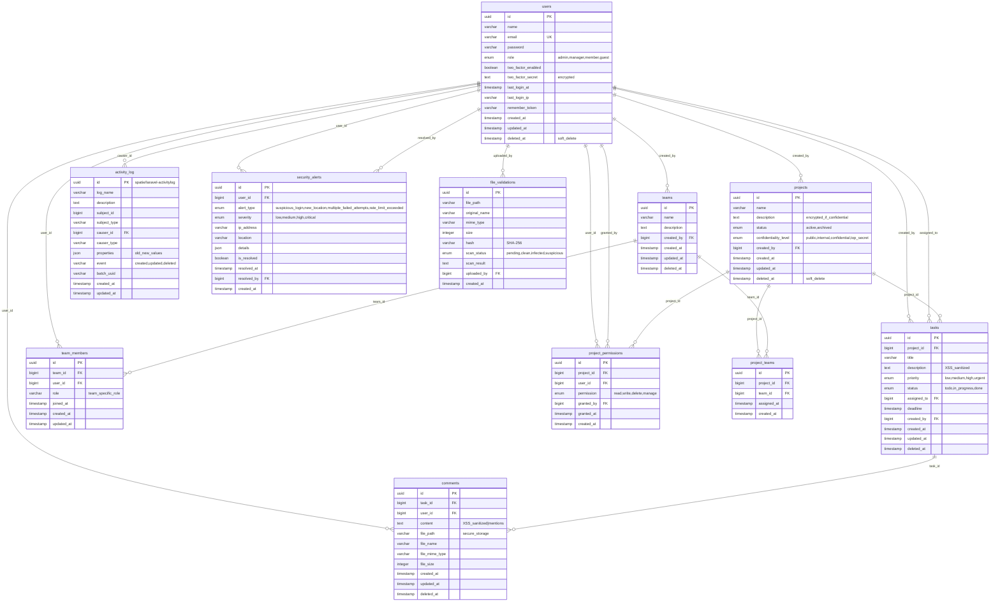

## High level functions

### Feature Requirements

| Functional Requirement           | Priority      |
| -------------------------------- | ------------- |
| User Management & Authentication | P1 (Critical) |
| Project Management               | P1 (Critical) |
| Task Management                  | P2 (High)     |
| Team Collaboration               | P2 (High)     |
| Communication & Comments         | P2 (High)     |
| Dashboard & Reporting            | P3 (Medium)   |
| Search & Filtering               | P3 (Medium)   |
| Notifications & Alerts           | P3 (Medium)   |
| Advanced Security Features       | P4 (Bonus)    |
| File Management                  | P4 (Bonus)    |

---

### Feature Details

#### P1 (Critical) - User Management & Authentication

- User registration and login
- Role-based access (admin, manager, member, guest)
- Two-factor authentication (2FA) - _optional_
- Session management and logout

#### P1 (Critical) - Project Management

- Create, edit, delete projects
- Project confidentiality levels (public, internal, confidential, top_secret)
- Project status management (active, archived)
- Archive and restore projects

#### P2 (High) - Task Management

- Create, edit, delete tasks
- Assign tasks to team members
- Set task priority (low, medium, high, urgent)
- Task status tracking (todo, in_progress, done)
- Set deadlines for tasks

#### P2 (High) - Team Collaboration

- Create and manage teams
- Assign team members with specific roles
- Assign teams to projects
- Granular permission management per project

#### P2 (High) - Communication & Comments

- Comment on tasks
- File attachments on comments
- Mention system (@username notifications)
- Task modification history

#### P3 (Medium) - Notifications & Alerts

- Deadline reminders
- Mention notifications
- Security alerts for suspicious activities
- New location/IP login alerts

#### P3 (Medium) - Dashboard & Reporting

- Real-time project statistics
- Task progress overview
- Admin audit reports
- Team performance metrics

#### P3 (Medium) - Search & Filtering

- Full-text search across projects and tasks
- Filter by confidentiality level
- Filter by status, priority, assignee

#### P4 (Bonus) - Advanced Security Features

- Suspicious login detection
- Automated security compliance reports
- Activity audit trail with before/after data
- Rate limiting based on user behavior

#### P4 (Bonus) - File Management

- Secure file upload with validation
- MIME type verification
- Basic antivirus scanning
- Secure file storage

---

#### Future Enhancements

- Per-project AES-256 encryption key rotation
- Antivirus file scanning integration (ClamAV)
- Geolocation-based security alerts
- SIEM integration for centralized monitoring
- Automated security testing and penetration testing
- Advanced rate limiting with behavioral analysis

---

## DB ERD



## Security Implementation Plan

#### Phase 1: Core Security

**Authentication & Authorization**

- Laravel Sanctum for API token management
- Login/Register with rate limiting (throttle:5,1)
- Password hashing with bcrypt
- Middleware protection on sensitive routes
- Role-based access control (RBAC) and Attribute-based access control (ABAC)

```php
// Policy example
public function update(User $user, Project $project)
{
    return $user->id === $project->created_by || $user->role === 'admin';
}
```

**Input Validation**

- Form Requests for all POST/PUT endpoints
- XSS protection via Laravel escaping and strip_tags()
- SQL Injection prevention through Eloquent ORM
- CSRF protection handled by Sanctum (with SPA authentication by using csrf tokens)

```php
// CreateProjectRequest
public function rules()
{
    return [
        'name' => 'required|string|max:255',
        'description' => 'required|string|max:5000',
        'confidentiality_level' => 'required|in:public,internal,confidential,top_secret',
    ];
}
```

**Audit Logging**

- Integration with spatie/laravel-activitylog
- Automatic change tracking on critical models
- Complete audit trail for compliance

```php
use Spatie\Activitylog\Traits\LogsActivity;
use Spatie\Activitylog\LogOptions;

class Project extends Model
{
    use LogsActivity;

    public function getActivitylogOptions(): LogOptions
    {
        return LogOptions::defaults()->logOnly(['name', 'status', 'confidentiality_level']);
    }
}
```

#### Phase 2: Advanced Access Control

**Granular Permissions**

- Project-level permission management
- Permission validation in Service layer
- Query scoping based on user access rights

```php
// ProjectService
public function update(Project $project, UpdateProjectDTO $dto, User $user)
{
    if (!$this->canUserEdit($user, $project)) {
        throw new UnauthorizedException();
    }
    // update logic
}

private function canUserEdit(User $user, Project $project): bool
{
    return $user->role === 'admin'
        || $project->created_by === $user->id
        || ProjectPermission::where('project_id', $project->id)
            ->where('user_id', $user->id)
            ->whereIn('permission', ['write', 'manage'])
            ->exists();
}
```

**File Upload Security**

- MIME type validation: mimes:pdf,jpg,png|max:5120
- UUID-based unique filenames
- Private storage outside public directory
- SHA-256 hash verification
- File validation tracking

```php
$file = $request->file('attachment');
$hash = hash_file('sha256', $file->getRealPath());
$path = $file->store('uploads', 'private');

FileValidation::create([
    'file_path' => $path,
    'mime_type' => $file->getMimeType(),
    'hash' => $hash,
    'uploaded_by' => auth()->id(),
]);
```

#### Phase 3: Enhanced Security Features

**Two-Factor Authentication**

- Integration with pragmarx/google2fa-laravel
- User-controlled 2FA activation
- Encrypted secret storage
- QR code generation for authenticator apps

```php
// Enable 2FA
$google2fa = app('pragmarx.google2fa');
$secret = $google2fa->generateSecretKey();
$user->two_factor_secret = encrypt($secret);
$user->two_factor_enabled = true;
$user->save();

// QR Code generation
$qrCodeUrl = $google2fa->getQRCodeUrl(
    config('app.name'),
    $user->email,
    $secret
);
```

**Data Encryption**

- Field-level encryption for sensitive data
- Automatic encryption for top_secret projects
- Secure key management

```php
// In ProjectService
if ($project->confidentiality_level === 'top_secret') {
    $project->description = encrypt($dto->description);
} else {
    $project->description = $dto->description;
}
```

**Security Monitoring**

- IP address tracking for login sessions
- Automated alerts for suspicious activities
- New location detection and notifications

```php
// In AuthService after login
if ($user->last_login_ip !== $request->ip()) {
    SecurityAlert::create([
        'user_id' => $user->id,
        'alert_type' => 'new_location',
        'severity' => 'medium',
        'ip_address' => $request->ip(),
    ]);
}
```

#### Security Architecture

**Implementation Stack**

- **Controller Layer**: Input validation and request handling
- **Service Layer**: Business logic and permission enforcement
- **Repository Layer**: Data access through Eloquent ORM

**Risk Mitigation**

- XSS: strip_tags() combined with Laravel's default escaping
- CSRF: Sanctum SPA authentication
- SQL Injection: Eloquent parameterized queries
- Brute Force: Rate limiting on authentication endpoints
- File Upload Attacks: MIME validation and private storage
